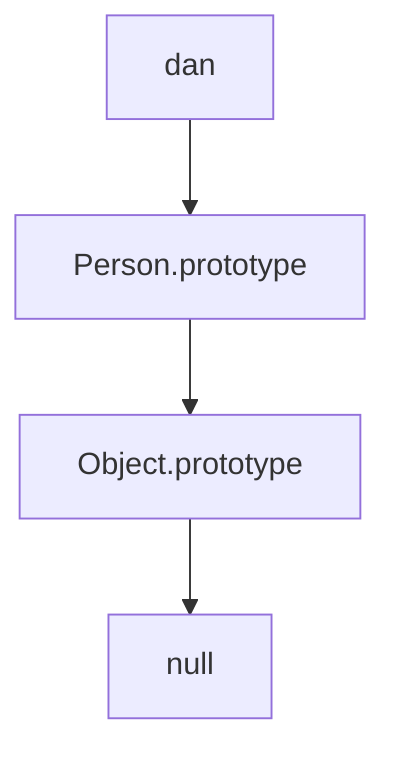

# Inmutabilidad

Es un estado en el que los datos que usamos no se pueden modificar una vez creados. Al usar inmutabilidad cuando se quiere hacer un cambio en una variable, la única manera es crear una nueva variable, copiando los valores de la variable original y sustituyendo los valores que nos interesan. 

La inmutabilidad no es algo que venga por defecto con el lenguaje, solamente es una posibilidad que nos da el mismo:

```js
const obj = {
	name: ' Test',
	desc: 'Desc 1'
};

// Para modificar el objeto usando inmutabilidad:
const newObject = {
	...obj,
	name: "Test updated"
};

// Para modificar el objeto sin usar inmutabilidad:
obj.name = "Test updated";
```

 
 Los **7 tipos primitivos** de javascript son inmutables. Los tipos **estructurales** de javascript (objetos, arrays) no son inmutables por defecto, se require cierta implementación o adopción por nuestra parte.

> [!question] **¿Qué significa que son inmutables?**
> Si yo asigno a dos variables diferentes un valor primitivo, como el número 4, ambas variables apuntan al mismo valor en memoria dado que no es posible modificar ese valor 4 en memoria.
  
```js
const myAge = 5;
const yourAge = 5;

console.log('is myAge equal to yourAge? ', myAge === yourAge); // true;

const boy = { age: 16 };
const boy2 = boy; //Estoy haciendo que el puntero en memoria de boy2 apunte                    al mismo sitio que boy
const boy3 = { age: 16 };

console.log('is boy equal to boy2? ', boy === boy2); // true
console.log('is boy equal to boy3? ', boy === boy3); // false

boy.age = 17; //Dado que boy es mutable, estoy modificando el valor de boy                 y de boy2 al modificar el puntero

console.log({ boy, boy2, boy3 })
```

# This

Indica quién invoca a la función, su contexto, apunta al scope de la variable dentro de la función. El this es un puntero y podemos decirle a dónde debería apuntar. Por defecto, en el cliente (navegador), será el contexto global (objeto window).

```js
function greetMessage(message) {
	console.log(message + " " + this.nombre);
}

//window.nombre = "World"
var nombre = "World";

greetMessage("Hello"); // this.who es "World" ya que this sería el contexto global

```

## Manipulación del contexto de una función: call, bind y apply

### Call & Apply

En ambos casos, pasamos el contexto para esa ejecución. La diferencia entre call y apply es la forma de pasar los argumentos a la función una vez asignado el contexto, en caso de haberlos:

- **call**. Pasamos los argumentos separados por comas (,)
- **apply**. Pasamos los argumentos como un array ([])

```js
function greetMessage(message) {
	console.log(message + " " + this.name);
}

const person = {
	name: 'John';
}

greetMessage.call(person, "Hello");
greetMessage.apply(person, ["Hello"]);
// this name es "John" ya que el contexto es person

const pedro = {
	name: 'Pedro'
}
const greetPedro = greetMessage.bind(pedro); 
// cuando llamemos a greetPedro su contexto siempre será me porque lo hemos "atado" con bind

greetPedro("Hola");
```

### Bind

Atamos la función a un nuevo contexto para siempre

```js
function greetMessage(message) {
	console.log(message + " " + this.name);
}

const pedro = {
	name: 'Pedro'
}
const greetPedro = greetMessage.bind(pedro); 
// cuando llamemos a greetPedro su contexto siempre será me porque lo hemos "atado" con bind

greetPedro("Hola");
greetPedro("Hello");

```

# Functions & Arrow Functions

- **functions**. Elementos invocables que reciben una serie de argumentos y pueden devolver valores.
- **arrow functions**. Una función que se ejecuta y que almacenamos en una variable. 

```js

function greet() {
	console.log('Hello World!');
}

const greetArrowFunction = () => console.log('Hello, World!');
```

## Las funciones son ciudadanos de primer orden o de alto nivel

Esto significa que **se pueden usar como cualquier otro tipo de datos que son invocables**:
	1. Puedes almacenar funciones en variables
	2. Puedes usar funciones como argumentos
	3. Puedes devolver funciones.

```js

// - Funciones como argumentos de otras funciones
function saySomething(text, modifier) {
	console.log(modifier(text));
}

saySomething("HeLlO wOrLd", str => str.toLowerCase()); // hello world

saySomething("hello world", str => str.replace(/[aeiou]/gi, "")); // hll wrld

  

// - Funciones como valor de retorno
const createCounter = () => {
	let i = 0;
	return () => console.log(++i);
};

const countFn = createCounter();
countFn(); // 1
countFn(); // 2
countFn(); // 3
// ⚠ En este último ejemplo hemos empleado un CLOSURE!
```


## Diferencias entre function y arrow function

Las arrow function se crearon como parte de ESNext (todas las versiones de ECMAScript superiores a la 5 (ES6 >=). 

- En las funciones clásicas, el this se resuelve en tiempo de ejecución (runtime binding), en el momento en el que se ejecutan se resuelve el this (su contexto de ejecución).
- En las arrow functions, el this se resuelve en tiempo de desarrollo. El **this no varía** nunca, siempre está atado y apunta al contexto en el que se ha creado la función.

```js
function f() {
	console.log(this.age);
}

f(); // this es el contexto global, el objeto window
f.call({ age: 5 }); // this es el contexto que se le pasa por parámetros

// En arrow functions:

const f = () => console.log(this.age);
f(); // this es el contexto global
f.call({age: 5}); //this es el contexto global
```

#### Arrow Functions & Async code

El código asíncrono es invocado por el contexto global, para invocar código asíncrono desde otro contexto hasta ES6 teníamos que almacenar dicho contexto dentro de una variable o usar bind.


```js
function Person(age) {
	this.age = age;
}

Person.prototype.sayAge = function() {
	console.log(this.age);
}

Person.prototype.sayDelayedAge = function() {
	const self = this;
	setTimeout(function() {
	// No podemos usar this porque el código                                            asíncrono se ejecuta en el contexto global                                       incluso si a la función sayDelayedAge le                                         pasamos el contexto correcto
		console.log(self.age); 
	}, 1000);
}

Person.prototype.sayDelayedAge2 = function() {
	const sayAge = function() {
		console.log(this.age); 
	};
	
	setTimeout(this.sayAge.bind(this), 1000);
}

const me = new Person(38);

me.sayDelayedAge();
```

A partir de ES6, con la existencia de las arrow function, podemos usar la arrow function porque el *this* siempre será el contexto dónde se ha declarado la arrow functions:

```js
function Person(age) {
	this.age = age;
}

Person.prototype.sayAge = function() {
	console.log(this.age);
}

Person.prototype.sayDelayedAge = function() {
	const sayAge = () => {
		console.log(this.age); 
	};
	
	setTimeout(sayAge, 1000);
}

const me = new Person(38);

me.sayDelayedAge();
```

#### Limitaciones de las arrow functions

1. No se puede usar la palabra reservada **arguments**. En las funciones podemos usar *arguments* para acceder al array de arguments de la función, esto no está disponible en las arrow functions.
2. No se pueden usar como **constructores**. Dado que el this de las arrow function solo se ata al contexto donde se definen, no se pueden usar como constructores ya que nunca se puede atar al objeto que crea el *new*.
3. No puede tener **prototipo**. No tienen propiedad proto, ya que no tienen constructor.

```js
function sum() {
	let total = 0;
	for (const num of arguments) { // arguments solo existe en functions
		total+= num;
	}
	return total;
}
```

# Prototype model

JS no proporciona un modelo o implementación de clases en si mismo, sino que es un lenguaje dinámico, basado en objetos, es decir, instancias en memoria.

>[!question]+ ¿Cuál es la diferencia entre una clase y un objeto?
>- Una clase es un molde a partir del cuál se construyen instancias del mismo, al ser una representación no existe en la realidad, solo sobre el papel. El contenido puede variar pero la forma siempre será la misma.
>- Un objeto sería la materialización del molde en la realidad, se pueden crear tantos objetos o instancia como quieras.
Pues bien, en JS todo son objetos, es decir, instancias. No existen los moldes (o clases)

## Función constructora y operador new

- **Función constructora** Su misión es construir objetos del tipo que le digas, objetos personalizados:

```js
function Person (name) {
	this.name = name;
	this.greet = function () {
		console.log("Hello, I'm " + this.name);
	};
}

const dan = new Person("Dan");
const james = new Person("James");
dan.greet(); // "Hello, I'm Dan"
james.greet(); // "Hello, I'm James"


console.log(dag.greet === james.greet); // false y esto es un problema
```

*this* representa a quién llama a la función constructora, al final representará al propio objeto creado por *new*.

### Prototipo

Es el sitio en el que se pueden definir todas las funciones reutilizables de un tipo para que siempre que se haga referencia a ellas apunten al mismo sitio en memoria. 

```js

function Person(name) {
	this.name = name;
}

Person.prototype.greet = function () {
	console.log("Hello, I'm " + this.name);
};

const dan = new Person("Dan");
const james = new Person("James");
dan.greet(); // "Hello, I'm Dan"
james.greet(); // "Hello, I'm James"  

console.log(dag.greet === james.greet); // true
```

> [!faq]+ ¿Qué hace `new`?
> 1. Crea un objeto vacío al que le va a dar forma la función constructora
> 2. Hace que el objeto vacío invoque a la función constructora
> 3. Vincula los prototipos a la instancia creada con su función constructora

Cuando hacemos una comparación con ***instanceof*** lo que se hace por debajo es comprobar si el prototipo de la instancia coincide con el prototipo el tipo:

```js
console.log(Person.prototype === Object.getPrototypeOf(dan));

// es equivalente a:

console.log(dan instanceof Person);
```

Dentro de la herencia prototípica, una instancia puede tener muchos prototipos a la vez o ser instanceof muchos prototipos a la vez si están en la **cadena prototípica**.

JavaScript, cuando invoca a una propiedad de un objeto, primero busca en la instancia del objeto y después invoca al prototipo del objeto a buscarlo si no la ha encontrado.

## Herencia prototipica

Los prototipos se enlazan entre sí, es decir, en nuestro ejemplo el tipo Person tiene su prototipo que a su vez enlaza con el prototipo de object:



